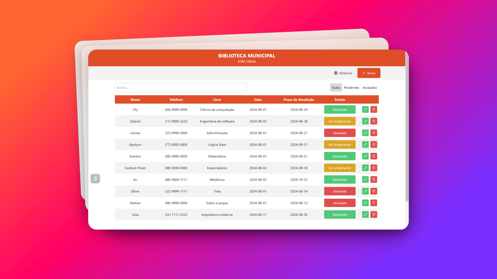

# Gerenciador de Livros Alugados



## Descrição
Sistema utilizado na gestão de aluguel de livros na biblioteca municipal de Ipameri GO. Este é um aplicativo Electron desenvolvido com React, que permite a gestão eficiente de empréstimos de livros, incluindo funcionalidades para adicionar, editar, deletar e filtrar empréstimos de acordo com o status ("Em andamento", "Atrasado", "Devolvido").

## Tópicos
- [Instalação](#instalação)
- [Scripts Disponíveis](#scripts-disponíveis)
- [Dependências](#dependências)
- [Estrutura do Projeto](#estrutura-do-projeto)
- [Contribuição](#contribuição)
- [Licença](#licença)

## Instalação

1. Clone o repositório:
    ```sh
    git clone https://github.com/GustavoOly/Sistema-de-gestao-de-aluguel.git
    ```
2. Navegue até o diretório do projeto:
    ```sh
    cd gerenciador_de_livros_alugados
    ```
3. Instale as dependências:
    ```sh
    npm install
    ```

## Scripts Disponíveis

No diretório do projeto, você pode executar:

### `npm start`
Roda o aplicativo em modo de produção.
### `npm run dev`
Roda o aplicativo em modo de desenvolvimento.
### `npm run build`
Compila o aplicativo para produção.
### `npm run build:win`
Compila o aplicativo para Windows.
### `npm run build:mac`
Compila o aplicativo para macOS.
### `npm run build:linux`
Compila o aplicativo para Linux.
### `npm run format`
Formata o código usando Prettier.
### `npm run lint`
Verifica o código usando ESLint e corrige problemas automaticamente.
### `npm run postinstall`
Instala as dependências do Electron Builder após a instalação principal.

## Dependências

### Produção
- `@electron-toolkit/preload`: ^3.0.1
- `@electron-toolkit/utils`: ^3.0.0
- `better-sqlite3`: ^11.1.2
- `dotenv`: ^16.4.5
- `electron-updater`: ^6.1.7
- `react-icons`: ^5.2.1
- `react-modal`: ^3.16.1
- `react-router-dom`: ^6.25.1
- `tailwindcss-animated`: ^1.1.2

### Desenvolvimento
- `@electron-toolkit/eslint-config`: ^1.0.2
- `@electron-toolkit/eslint-config-prettier`: ^2.0.0
- `@vitejs/plugin-react`: ^4.3.1
- `autoprefixer`: ^10.4.19
- `electron`: ^31.0.2
- `electron-builder`: ^24.13.3
- `electron-vite`: ^2.3.0
- `eslint`: ^8.57.0
- `eslint-plugin-react`: ^7.34.3
- `postcss`: ^8.4.39
- `prettier`: ^3.3.2
- `react`: ^18.3.1
- `react-dom`: ^18.3.1
- `tailwindcss`: ^3.4.6
- `vite`: ^5.3.1

## Estrutura do Projeto

A estrutura básica do projeto é a seguinte:

```
├── src/
│   ├── main/
│   │   ├── index.js
│   ├── renderer/
│   │   ├── components/
│   │   ├── hooks/
│   │   ├── App.jsx
│   │   ├── index.jsx
├── out/
│   ├── main/
│   │   ├── index.js
├── database/
│   ├── database.db
├── package.json
├── tailwind.config.js
├── vite.config.js
└── README.md
```

## Contribuição

1. Fork o repositório.
2. Crie uma branch para sua feature (`git checkout -b feature/nova-feature`).
3. Commit suas mudanças (`git commit -am 'Adiciona nova feature'`).
4. Push para a branch (`git push origin feature/nova-feature`).
5. Abra um Pull Request.
